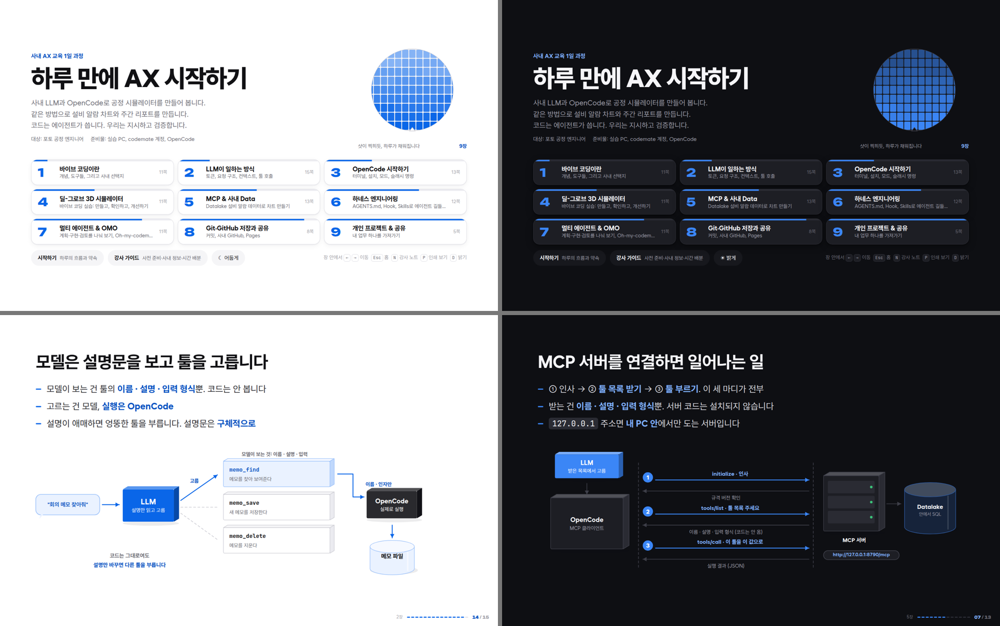

# Foundry Photo 기초 AX 교육

하루 만에 AX 시작하기. 포토 공정 엔지니어를 위한 1일 과정 교안입니다.

제작: Foundry Photo 혁신 AX팀 변진규



## 바로 보기

`dist/AX교육_교안.html` 을 브라우저로 엽니다. 파일 하나에 다 들어 있어 폐쇄망에서도 됩니다.

| 키 | 하는 일 |
|---|---|
| ← → | 쪽 이동 |
| Esc | 홈 |
| N | 강사 노트 |
| P | 인쇄 보기 |
| D | 밝게 · 어둡게 |

## 고치고 다시 만들기

```
python build.py
```

- 슬라이드 글: `src/content/*.js`
- 사내 정보(설치·설정·GitHub·Datalake): `src/site/site.js` 한 파일
- 자세한 구조: [`src/README.md`](src/README.md)

## 폴더

| 폴더 | 내용 |
|---|---|
| `src/` | 교안 소스 (슬라이드 · 데모 · 그림 · 스타일) |
| `kit/` | 수강생 실습 키트 (DealGrove.md, 알람 예시 데이터, 체크포인트) |
| `dist/` | 빌드된 교안 HTML |

## 보안

비밀번호, API 키, 개인 계정은 넣지 않습니다. 키는 `{env:변수명}` 으로만 씁니다.
